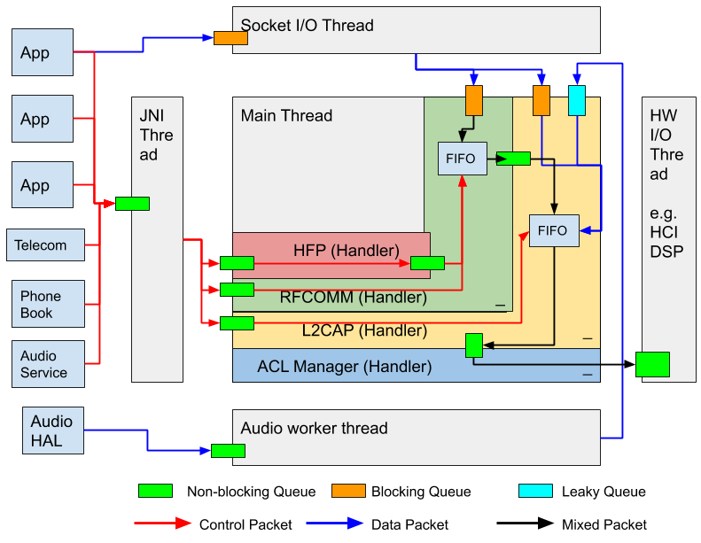

# Gabeldorsche Architecture

[TOC]

This document outlines some architectural considerations we've made when
developing the Gabeldorsche (GD) Bluetooth stack.

## Threading model

First of all, the GD stack does not build on concepts of threads. Instead, it
works with [`Handlers`](#handler). However, since GD ultimately runs on an OS,
it still needs to interact with processes and threads before achieving the
[`Handler`](#handler) abstraction.

### Processes

In general. three types of processes exist in the GD runtime environment:

**Application processes**
:   include third-party apps, other system components such as audio and telecom
    services that interact with the _Bluetooth stack process_ APIs defined
    through various RPC/IPC methods such as Binder, Socket IPC, gRPC, DBUS. and
    so on, using languages such as AIDL or Protobuf. For Android applications,
    although APIs are defined in AIDL, some boiler plate code is wrapped in Java
    libraries exposed through code in
    [`frameworks/base/core/java/android/bluetooth`](https://android.googlesource.com/platform/frameworks/base/+/refs/heads/master/core/java/android/bluetooth/)
    that is released to developers as
    [Android SDK](https://developer.android.com/guide/topics/connectivity/bluetooth).

**Hardware abstraction layer (HAL) processes**
:   one or many processes from the vendor partition, and hence is hardware
    depenedent. They interact with the _Bluetooth stack process_ via a set of
    hardware abstraction APIs defined through RPC/IPC methods such as Binder,
    Socket IPC, DBUS, and so on, using languages such as HIDL. On Android, this
    would be HAL processes that implement HIDL APIs such as
    [IBluetoothHci](https://android.googlesource.com/platform/hardware/interfaces/+/refs/heads/master/bluetooth/1.1/IBluetoothHci.hal)
    and
    [IBluetoothAudioProvider](https://android.googlesource.com/platform/hardware/interfaces/+/refs/heads/master/bluetooth/audio/2.0/IBluetoothAudioProvider.hal).

**Bluetooth stack process**
:   typically one single process that implements various Bluetooth protocols and
    profiles above the Host Controller Interface (HCI) and below the Bluetooth
    SDK APIs. On one hand, it servces the requests from _Application processes_;
    on the other hand, it forwards these requests via interactions with _HAL
    processes_. On Android, this process typically runs under AID_BLUETOOTH
    (usually 1002) with process name "com.android.bluetooth". The process is
    started in Java and loads native libraries through JNI. Other systems that
    do not use Java virtual machine may have a pure native process. Multiple
    threads may exist in this process for various reasons. The GD stack runs
    entirely in this process.

### Threads in Bluetooth stack process

Currently, the goals of thread optimization in the Bluetooth stack are:

*   Reduce the number of threads as much as possible to simplify synchronization
*   Do blocking I/O operations in separate threads
*   Try moving I/O operations into polling mode so that we can use event driven
    methods to interact with it on main thread
*   Move alarm and timer mechanisms to their calling threads to avoid a separate
    alarm thread
*   Isolate individual components so that each component can be started and
    stopped individually without terminating the main thread
*   Prefer data passing over data sharing among threads to reduce locking and
    race conditions

After above optimization, we are left with five main types of threads within the
native code:

**Main thread**
:   The main workhorse in the Bluetooth stack. The thread's execution context is
    further divided into [`Handlers`](#handler) that reside in individual
    [`Modules`](#module). This thread can be divided further into smaller ones
    if performance is constrained on the running platform. Deployer just needs
    to bind handlers to different threads and that should not affect the overall
    operation.

**JNI thread**
:   In the native thread, we treat the Java layer as a separate application as
    its threading module is completely different. Therefore, we put a thread
    between these two layers to buffer any blocking operation.

**HCI thread (or other HW I/O thread)**
:   This thread is responsible for deadling with hardware I/O and can be
    potentially blocking. Hence it has its separate thread to avoid blocking the
    main thread.

**Audio worker thread**
:   Responsible for audio encoding and decoding operations that require higher
    precision execution timing. Such worker has its separate thread to avoid
    being affected by the main thread.

**Socket I/O thread**
:   Communicate with various applications that uses the
    [`BluetootSocket`](https://developer.android.com/reference/android/bluetooth/BluetoothSocket)
    interface. It has its sepearate thread due to potential I/O delay.

### Data flow diagram

Function invocations between different components are abstracted as control
packets (function closure) passed through queues. Data flow between components
are data packets sent through queues, signaled using [`Reactor`](#reactor). They
will merge to the input queue for each component. We define three types of
queues:

**Non-blocking queue**
:   When users try to dequeue when it’s empty, or enqueue when it’s full, it
    will return immediately. All queueing within a thread must be non-blocking,
    because otherwise it will deadlock.

**Blocking queue**
:   When users try to dequeue when it’s empty, or enqueue when it’s full, it
    will block, until other thread makes the queue to be writable/readable. It
    can be used as a flow control mechanism to avoid too many packets from user
    thread.

**Leaky queue**
:   Same as non-blocking queue, but it will flush when it’s full and user tries
    to enqueue. This is useful for audio encoding.



## Building blocks

### Module {#module}

Code in GD is packed into C++ objects called
[`Module`](https://android.googlesource.com/platform/system/bt/+/master/gd/module.h).
A module standardized the following aspects of GD code:

*   **Dependencies**: A module provides its own dependencies on other modules by
    implementing `ListDependencies()`
*   **Life Cycle**: A module must implement `Start()` and `Stop()` life cycle
    methods
*   **Threading Module**: The `Module` base class provides a `Handler` for code
    execution context via `GetHandler()`
*   **Metrics**: A `Module` can dump its state information for dumpsys through
    `DumpState()`

See its definition at: https://android.googlesource.com/platform/system/bt/+/master/gd/module.h

### Handler {#handler}

Similar to
[`android.os.Handler`](https://developer.android.com/reference/android/os/Handler),
[`bluetooth::os::Handler`](https://android.googlesource.com/platform/system/bt/+/master/gd/os/handler.h)
provides a sequential execution context while hiding the concept of thread from
the executing code.

By scoping execution context into smaller areas, `Handler` benefits development
in the following ways:

*   Less need for locking due to sequential execution context
*   Smaller context leads to easier management of code flow
*   Separation from thread gives system deployer more freedom to tweak the
    underlying thread allocation. For example, for real time OS without full
    thread implementation, a `Handler` can be used to provide a near-thread
    execution context

Of course, there are downsides of using `Handler`, which developers should be
cautious about:

WARNING: Although multiple `Handler` could bind to the same thread, `Handler`
does not gurantee sequential execution of code across different `Handler` even
when the are on the same thread.

WARNING: Locking among `Handlers` that were bound to the same thread may result
in deadlock

WARNING: Data must be copied between `Handler` to avoid both deadlock and race
condition

See its definition at: https://android.googlesource.com/platform/system/bt/+/master/gd/os/handler.h

### Reactor {#reactor}

[`bluetooth::os:Reactor`](https://android.googlesource.com/platform/system/bt/+/master/gd/os/reactor.h)
implements the
[Reactor Design Pattern](https://en.wikipedia.org/wiki/Reactor_pattern), in
which concurrent _Events_ are demultiplexed by a _Synchronous Event
Demultiplexer_ to a list of _Request Handlers_ registered through a
_Dispatcher_.

In a generic Linux operating system, such as Android, we implemented it using
file descriptors such as
[eventfd](http://man7.org/linux/man-pages/man2/eventfd.2.html) for `Handler`,
[timerfd](http://man7.org/linux/man-pages/man2/timerfd_create.2.html) for
`Alarm`, and [socketfd](http://man7.org/linux/man-pages/man2/socket.2.html) for
data processing pipelines. In the context of file descriptors, events are
catigorized into two types:

*   **OnReadReady**: means that the demultiplexer has some events for the
    handler and the handler can read at least one event from the underlying
    event queue. This is often associated with `EPOLLIN`, `EPOLLHUP`,
    `EPOLLRDHUP`, and `EPOLLERR`.
*   **OnWriteReady**: means that the demultiplexer is ready to consume more
    events from this handler, and the handler can write at least one event to
    the underlying queue. this is often associated with `EPOLLOUT`.

This pattern naturally creates a back pressure from one queue to another without
any extra signaling mechanism. When used in networking stack like ours, it
simplifies the signaling code flow.

See its definition at:
https://android.googlesource.com/platform/system/bt/+/master/gd/os/reactor.h

A pure data use case of `Reactor` is a `Reactive Queue`, see its definition at:
https://android.googlesource.com/platform/system/bt/+/master/gd/os/queue.h

## Packet Definition Language (PDL)

Packet parsing and serialization has been a big part of any networking stack. It
is usually the first snippet of code that interface with a remote device. In the
past, this has been achieved manually using macros like `STREAM_TO_UNIT8` or
`UINT8_TO_STREAM`. This manual method is tedious and errorprone. To fix this, we
created a Packet Definition Language that defines networking packet structure to
the bits level. C++ headers and Python bindings will be automatically generated
from its code generator and any fixes to the code generator will apply
systematically to all packet code generated.

Example PDL:

```
// Comments
little_endian_packets // Whether this packet is big or small endian

// Include header from other C++ header files
custom_field SixBytes : 48 "packet/parser/test/" // expect six_bytes.h
custom_field Variable "packet/parser/test/" // expect variable.h

// A packet
packet Parent {
  _fixed_ = 0x12 : 8, // fixed field 0x12 that takes 8 bits
  _size_(_payload_) : 8, // Size field that takes 8 bits
  _payload_, // special payload field of variable size
  footer : 8, // fiexed size footer of 8 bits
}

packet Child : Parent {
  field_name : 16, // addition field append after Parent
}

// an enum of 4 bits
enum FourBits : 4 {
  ONE = 1,
  TWO = 2,
  THREE = 3,
  FIVE = 5,
  TEN = 10,
  LAZY_ME = 15,
}
```

See its documentation at:
https://android.googlesource.com/platform/system/bt/+/master/gd/packet/parser/README

## Calling convention between modules

### Asynchronous server-client model

For most communication among modules, developers should assume an asynchronous
server-client model in a generic model like:

```c++
// Define callback function type
using CallbackFunction = std::function<void(ParamType)>;

// Asynchronous method definition
bool Foo(Parameter param, CallbackFunction callback);

// A new callback is passed for each asynchronous call
// Always prefer lambda over std::bind
CallbackFunction callback = [this] {
  // do something
};
Parameter param = {
  // something
};
if (Foo(param, callback)) {
   // The callback will be invoked
   // Callback must be invoked in the future
} else {
   // Failed, no need to wait
}
```

Many protocols and profiles fit into such model such as `AclManager` and
`L2cap`.

### Synchronous database model

In some cases, an asynchronous server-client model is not feasible. In this
case, developers can consider a synchronous database model. In such a model,
operations can happen synchronously with help of mutex. When the method returns,
the changes must be reflected to all dependencies. Any changes in the internal
states must be applied atomically.

```c++
// Synchronous method definition
void Foo(Parameter param, Output* output);
int Bar(Parameter param);
Parameter param = {
  // something
};
Output output = {};
Foo(param, &output);
// output can be used immediately
int bar_output = Bar(param);
// bar_output can be used immediately
```

Many storage and informational modules fit into this model such as `Metrics` and
`Storage`.
