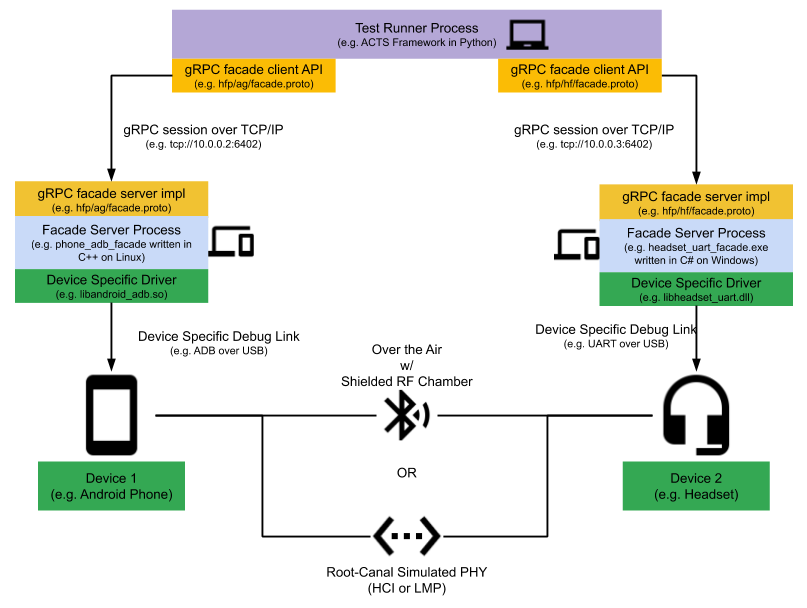

# Gabeldorsche Certification Tests

[TOC]

## What is GD cert test

A core problem behind Bluetooth interoperability testing is testers' inability to
automate test operations on certain peripherals. For example, although an user
can automate API calls on Android with tools like
[SL4A](https://android.googlesource.com/platform/external/sl4a/) or ADB shell
commands, they often struggle with automating corresponding operations on
carkits, headsets, and smart watches. Even if they find a way to automatically
control one model of such peripheral device using device maker's tools or
self-developed after-market tools such as relays and robotic arms, such kind of
tool usually does not scale to other models of peripherals due to their
differences in physical user interfaces.

GD certification test framework comes into rescue. In
the framework, a common API is defined using a [gRPC](https://grpc.io/) protobuf
for profiles such as HFP, AVRCP and function groups like pairing, scanning, and
advertising. Everyone who wants to test their Bluetooth device implements an
**gRPC Facade Server** using this protobuf definition. This server executable is
responsible in gluing various gRPC based APIs with their device specific
automation hook through a **Device Specific Driver**. The server will then
expose an IP address and a port number to the test runner. A **Test Runner**
process will load and execute the actual test case and use the auto-generated
gRPC facade client APIs to interact with the device being tested. The following
diagram shows how the system could be configured:



## Terminology

**gRPC Facade**
:   A set of automation APIs of a specific profile (HFP, AVRCP, etc) or function
    group (pairing, scanning, advertising, etc) defined in gRPC protobuf format.

**Test Runner**
:   A process that loads and runs the actual test cases and use auto-generated
    gRPC facade client library to interact with test devices. Currently, the
    preferred test runner is the [Android ACTS](https://android.googlesource.com/platform/tools/test/connectivity/+/refs/heads/master/acts/)
    framework and test cases are written in Python for fast iteration and easy debugging

**gRPC Facade Server**
:   A concrete implementation of the gRPC automation APIs, which will convert
    RPC requests into invocations of device specific automation hook using a
    **Device Specific Driver**. This server can be written in any language and
    on any platform. The server need to expose an IP address and 3 ports

**Tester Signal Port**
:   A port to indicate that the server is ready for operation to the **Test
    Runner**

**gRPC Root Server Port**
:   A port that allows **Test Runner** to start and stop various functional
    facade services

**gRPC Facade Server Port**
:   A port that allows **Test Runner** to interact with actual profile
    implementations on the test device

**Device Specific Driver**
:   A library or some mechanism that allows the **gRPC Facade Server** to
    control the test device. This library is opaque to the **Test Runner** that
    should have no knowledge of how this component works * **Root-Canal**: A
    Bluetooth PHY emulator that takes either LMP or HCI packets. The goal is for
    this emulator to simulate a Physical RF environment without using any real
    Bluetooth adatper.

## How to run GD cert test in Android tree

Assume user has an Android checkout and finished `source build/envsetup.sh` and
`lunch` to a preferred target

### Run GD cert tests on host machine

```shell
$ANDROID_BUILD_TOP/system/bt/gd/cert/run --host
```

#### Python 3.8+
The cert tests require >python3.8 to operate and the associated python
virtualenv package.  The script may help properly install these requisites.

```shell
source $ANDROID_BUILD_TOP/system/bt/gd/cert/set_up_virtualenv.sh
```

### Run GD cert tests on devices for the first time

Connect at least two Android devices and follow on-screen instructions after
running the following command

```shell
$ANDROID_BUILD_TOP/system/bt/gd/cert/set_up_and_run_device_cert.sh
```

### Run GD cert tests on devices for the second time and after

Keeping the same set of devices connected

```shell
$ANDROID_BUILD_TOP/system/bt/gd/cert/run
```

### `system/bt/gd/cert/run` command reference

*   `--host`: Run tests on host only using `root-canal`
*   `--clean`: Remove any test setup files and do a clean test run
*   `--repeat=N`: Repeat running the same set of tests N times without redoing
    test setup
*   `--test_file=<file_name>`: Running only tests listed in `<file_name>`
*   `--test_filter=<test_filter>`: Test case filter in the format of
    "TestClass:test_case_name", for multiple test cases, quote them using " and
    separate each filter by space such as "TestClass1:test_case_1
    TestClass2:test_case_2"

### Run GD cert tests on devices over SSH

The following assumptions assume the following configuration

*   Local setup: Linux or MAC laptop with two Android phones connected
*   Remote setup: Linux or MAC workstation

1.  Check if your ADB version is up to date on both host machine and remote
    workstation. Both versions should be 29.0.3 or above. If not, uninstall and
    reinstall your adb.

1.  Enable SSH port forwarding for both ADB port and various ports used by our
    tests, run the following command on your Mac, assuming the following
    configuration {value=2}

    *   ADB Port: 5037
    *   Cert Device:
        *   gRPC Root Server Port: 8896
        *   gRPC Facade Port: 8898
        *   Signal Port: 8894
    *   Device Under Test:
        *   gRPC Root Server Port: 8897
        *   gRPC Facade Port: 8899
        *   Signal Port: 8895

    Among these ports, ADB Port needs to be forwarded from local machine to
    listen on remote workstation so that its adb client can connect to local
    machine's adb server (`ssh -R`). Signal Port needs to be forwarded from
    remote workstation to listen on local machine so that local phone can
    connect to Test Runner listening on this port during Facade Server bring up
    (`ssh -L`). Both gRPC Root Server Port and gRPC Facade Port need to be
    forwarded from local machine to listen on remote workstation so that Test
    Runner can connect to these ports on the Facade Server (`ssh -R`).

    Hence, the resulting `ssh` command is:

    ```shell
    ssh -R 5037:127.0.0.1:5037 -R 6401:127.0.0.1:6401 -R 6402:127.0.0.1:6402 \
    -R 6403:127.0.0.1:6403 -L 8894:127.0.0.1:8894 -L 8895:127.0.0.1:8895 \
    -R 8896:127.0.0.1:8896 -R 8897:127.0.0.1:8897 -R 8898:127.0.0.1:8898 \
    -R 8899:127.0.0.1:8899 <host_name>
    ```

1.  Connect all your devices, open a different terminal on your Mac and run

    ```shell
    adb kill-server && adb devices
    ```

    You should see devices on your local machine shows up

1.  SSH into your remote workstation and run

    ```shell
    adb kill-server && adb devices
    ```

    You should see same set of devices connected to your local machine

1.  Continue with device setup

    ```shell
    $ANDROID_BUILD_TOP/system/bt/gd/cert/set_up_and_run_device_cert.sh
    ```

1.  In subsequent runs

    ```shell
    $ANDROID_BUILD_TOP/system/bt/gd/cert/run
    ```

## How to debug GD cert tests

Logs are produced and saved whenever GD cert tests runs. Depending on how the
tests were run, the log root is different

When running tests on local Android checkout, logs or most recent run are stored
at

*   /tmp/logs/HostOnlyCert/latest

Navigate test logs

In test root, the following logs are available:

*   In every directory layer:
    *   test_run_debug.txt: DEBUG level output from Python logging API
        scoped at their respective layer based on the directory
*   In test root directory:
    *   test_summary.json: A summary test results, including stack traces
        for any failures and metadata
    *   test_configs.json: The ACTs config used to run this test
    *   GdDevice_cert_stack_backing_process_coverage_summary.txt: code
        coverage summary from llvm-cov
*   In test class directory:
    *   rootcanal_logs.txt: Root-Canal stdout and stderrr, host test only
    *   Cert stack logs:
        *   GdDevice_cert_stack_backing_logs.txt: facade server process log
        *   cert_stack_btsnoop_hci.log: HCI packet log on cert device
        *   cert_stack_system_log: Android phone logcat output, device based
            test only
    *   Device under test logs:
        *   GdDevice_stack_under_test_backing_logs.txt: facade server
            process log
        *   stack_under_test_btsnoop_hci.log: HCI packet log on cert device
        *   stack_under_test_system_log: Android phone logcat output, device
            based test only
    *   Individual test directories: logs for individual test cases

## PTS test case coverage

A Python decorator is used to indicate a test's association with a Bluetooth SIG
Profile Tuning Suite (PTS) Qualification test. For example

```python
@metadata(
    pts_test_id="L2CAP/EXF/BV-01-C",
    pts_test_name="Extended Features Information Response for "
    "Enhanced Retransmission Mode")
```

These information can be found at the Test Case Reference List (TCRL) document
in
[Qualification Test Requirements](https://www.bluetooth.com/specifications/qualification-test-requirements/)
page at the Bluetooth SIG website.

## Code coverage

If the facade server binary is compiled using [`clang`](https://clang.llvm.org/)
and with
[`-fprofile-instr-generate -fcoverage-mapping`](https://clang.llvm.org/docs/SourceBasedCodeCoverage.html)
flags. A `.profraw` file will be generated in ech test class log directory after
the test run. The Test Runner will then try to index these profiling data using
[`llvm-profdata`](https://llvm.org/docs/CommandGuide/llvm-profdata.html),
iteratively merge them from each test class, and generate a line-by-line test
coverage report using
[`llvm-cov`](https://llvm.org/docs/CommandGuide/llvm-cov.html).
